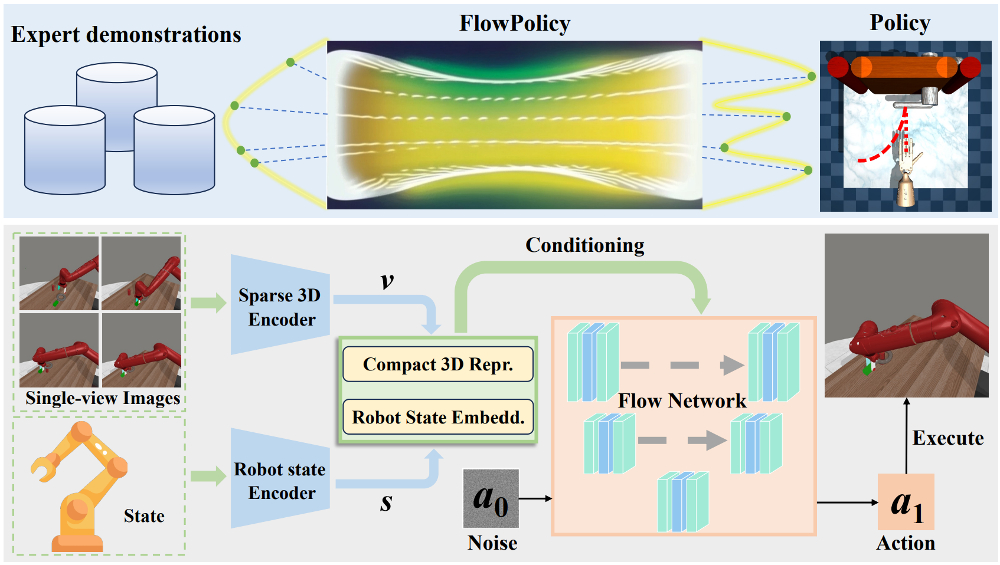

# [AAAI 2025 Oral] FlowPolicy: Enabling Fast and Robust 3D Flow-based Policy via Consistency Flow Matching for Robot Manipulation

<h4 align = "center">Qinglun Zhang<sup>1,2 *</sup>, Zhen Liu<sup>1,2 *</sup>, Haoqiang Fan<sup>2</sup>, Guanghui Liu<sup>1</sup>, Bing Zeng<sup>1</sup>, Shuaicheng Liu<sup>1,2</sup></h4>

<h4 align = "center"> <sup>1</sup>University of Electronic Science and Technology of China</center></h4>
<h4 align = "center"> <sup>2</sup>Megvii Technology</center></h4>

This is the official implementation of our AAAI2025 paper: FlowPolicy: Enabling Fast and Robust 3D Flow-based Policy via Consistency Flow Matching for Robot Manipulation. [Paper](https://arxiv.org/abs/2412.04987)

## News
* **2025.1.18** Our paper has been selected for **oral presentation** at AAAI 2025.
* **2024.12.17** The final version of our paper is now available on [arXiv](https://arxiv.org/abs/2412.04987).
* **2024.12.10** Our paper has been accepted by AAAI 2025.

## Abstract

Robots can acquire complex manipulation skills by learning policies from expert demonstrations, which is often known as vision-based imitation learning. Generating policies based on diffusion and flow matching models has been shown to be effective, particularly in robotic manipulation tasks. However, recursion-based approaches are inference inefficient in working from noise distributions to policy distributions, posing a challenging trade-off between efficiency and quality. This motivates us to propose FlowPolicy, a novel framework for fast policy generation based on consistency flow matching and 3D vision. Our approach refines the flow dynamics by normalizing the self-consistency of the velocity field, enabling the model to derive task execution policies in a single inference step. Specifically, FlowPolicy conditions on the observed 3D point cloud, where consistency flow matching directly defines straight-line flows from different time states to the same action space, while simultaneously constraining their velocity values, that is, we approximate the trajectories from noise to robot actions by normalizing the self-consistency of the velocity field within the action space, thus improving the inference efficiency. We validate the effectiveness of FlowPolicy in Adroit and Metaworld, demonstrating a 7x increase in inference speed while maintaining competitive average success rates compared to state-of-the-art methods. 

## Pipeline

<div align="center">
  
</div>
The above section is a visualization of FlowPolicy. By defining a straight-line flow the data can flow the fastest from the noise distribution to the action distribution (Adroit: Open the door). The following section shows the details of FlowPolicy. Given a certain number of expert presentations, it is first converted into 3D point clouds. The 3D point clouds and the robot state are then fed into two encoders to obtain the compact 3D visual representation and the robot state embedding, respectively. Finally, a straight-line flow is learned by conditional consistency flow matching to generate high-quality robot actions and perform the corresponding tasks (Metaworld: Assembly) at real-time inference speed.

---

# 💻 Installation

See [install.md](install.md) for the original Adroit / Metaworld setup.

### Franka Kitchen (state-based extension)

Use the dedicated conda environment:

```bash
conda activate flowpolicy-kitchen
```

Dependencies include `minari`, `gymnasium`, and `gymnasium_robotics`. See [flowpolicy_preprocessing.md](flowpolicy_preprocessing.md) and [flowpolicy_hyperparameter_finetuning.md](flowpolicy_hyperparameter_finetuning.md) for full experiment details.

---

# 📚 Data

## Adroit & Metaworld (original paper)

Generate demonstrations with the provided expert policies. Data is saved under `FlowPolicy/data/`.

```bash
bash scripts/gen_demonstration_adroit.sh hammer
bash scripts/gen_demonstration_metaworld.sh <task>
```

## Franka Kitchen

| Item | Value |
|------|--------|
| Dataset | `minari.load_dataset('D4RL/kitchen/complete-v2')` — 19 episodes |
| Environment | `FrankaKitchen-v1` (4 sub-tasks: microwave, kettle, light switch, slide cabinet) |
| Observation | 59-dim state vector (no point cloud) |
| Action | 9-dim velocity control |
| Split | 15 train / 3 val / 1 test (episode-level) |

**Preprocess** Minari demonstrations into zarr:

```bash
bash scripts/preprocess_kitchen.sh
```

Outputs:

- `FlowPolicy/data/kitchen_complete.zarr`
- `FlowPolicy/data/kitchen_complete_splits.json`

Details: [flowpolicy_preprocessing.md](flowpolicy_preprocessing.md)

---

# 🛠️ Usage

Scripts live in `scripts/` (repo root) and `FlowPolicy/scripts/` (Python entry points). Training logs use **Weights & Biases** — run `wandb login` first.

## Original benchmarks (Adroit & Metaworld)

1. **Generate demonstrations** (example: Adroit hammer):

   ```bash
   bash scripts/gen_demonstration_adroit.sh hammer
   ```

2. **Train** with behavior cloning:

   ```bash
   bash scripts/train_policy.sh flowpolicy adroit_hammer 0129 0 0
   ```

3. **Evaluate** a saved checkpoint:

   ```bash
   bash scripts/eval_policy.sh flowpolicy adroit_hammer 0129 0 0
   ```

   For benchmarking, use metrics logged in wandb during training; `eval_policy.sh` is mainly for deployment/inference.

---

## Franka Kitchen — State-Based FlowPolicy

This extension replaces PointNet with a **state-only MLP encoder** and targets the long-horizon Franka Kitchen task. Config: `flowpolicy_kitchen.yaml`, task: `kitchen_complete.yaml`.

### Experiment protocol

| Phase | Description |
|-------|-------------|
| **1. Baseline** | Train default hyperparameters with **early stopping** (§6.5 in [flowpolicy_hyperparameter_finetuning.md](flowpolicy_hyperparameter_finetuning.md)) |
| **2. Random search** | Sample hyperparameters from the search space; train each trial with early stopping |
| **3. Evaluation** | 50 episodes × seeds **`[0, 42, 101]`** → report mean ± std |
| **4. Plotting** | Success rate vs latency, trade-off vs val loss, sub-task success, etc. |

**Seeds:** `[0, 42, 101]` are used for both training and evaluation across the full experiment.

**Early stopping** (baseline and every search trial): both signals must be active after epoch ≥ 1000 — validation loss EMA stagnant (400 epochs) **and** light success-rate check stagnant (2 checks every 500 epochs). Best checkpoint: `best_val_loss_epochXXXX.ckpt`.

### Quick start — full pipeline

From the repo root:

```bash
conda activate flowpolicy-kitchen

# 1) Preprocess (once)
bash scripts/preprocess_kitchen.sh

# 2) Baseline + random search + plots
bash scripts/kitchen_run_experiment.sh 10 0
#            n_search_trials ^  gpu_id ^
```

- `kitchen_run_experiment.sh 0 0` — baseline only + plots (no search trials)
- `kitchen_run_experiment.sh 10 0` — baseline + 10 random-search trials + plots

### Step-by-step commands

#### Preprocessing

```bash
bash scripts/preprocess_kitchen.sh
# or:
cd FlowPolicy && python scripts/preprocess_kitchen_minari.py
```

#### Baseline training (single seed, early stopping)

```bash
bash scripts/train_kitchen.sh <seed> <gpu_id> <debug>
# Examples:
bash scripts/train_kitchen.sh 0 0 false
bash scripts/train_kitchen.sh 42 0 false
bash scripts/train_kitchen.sh 101 0 false
```

#### Baseline phase (all 3 seeds)

```bash
cd FlowPolicy
python scripts/kitchen_hparam_search.py --phase baseline --gpu 0 \
  --train-seeds 0 42 101 --eval-seeds 0 42 101 --eval-episodes 50
```

#### Random hyperparameter search

```bash
# N trials on GPU 0
bash scripts/kitchen_random_search.sh 10 0

# Single trial id=5
bash scripts/kitchen_random_search.sh 1 0 5

# Python (search only)
cd FlowPolicy
python scripts/kitchen_hparam_search.py --phase search --n-trials 10 --gpu 0 \
  --train-seeds 0 42 101 --eval-seeds 0 42 101
```

#### Evaluation (50 episodes × 3 seeds)

```bash
bash scripts/kitchen_eval_multiseed.sh <checkpoint.ckpt_or_run_dir> [gpu_id]
# Example:
bash scripts/kitchen_eval_multiseed.sh \
  FlowPolicy/data/outputs/kitchen_baseline_seed0/checkpoints/best_val_loss_epoch1500.ckpt 0
```

#### Plots (after experiments finish)

```bash
bash scripts/kitchen_plot_results.sh
# or:
cd FlowPolicy && python scripts/kitchen_plot_results.py
```

Generated under `FlowPolicy/data/hparam_search/plots/`:

| Plot | Description |
|------|-------------|
| `success_rate_vs_latency.png` | Success rate vs mean inference latency |
| `tradeoff_vs_val_loss.png` | Trade-off vs best validation loss (EMA) |
| `subtask_success_rates.png` | Success rates for sub-tasks k=1..4 |
| `tradeoff_vs_hparams.png` | Trade-off vs `num_segments` and `hidden_dim` |
| `latency_vs_num_segments.png` | Latency vs K (marker size ∝ success rate) |

### Results files

| Path | Content |
|------|---------|
| `FlowPolicy/data/hparam_search/baseline_results.jsonl` | Baseline runs (3 seeds) |
| `FlowPolicy/data/hparam_search/results.jsonl` | Random-search trials |
| `FlowPolicy/data/hparam_search/best_config.json` | Best trial by `trade_off_mean` |
| `FlowPolicy/data/hparam_search/plots/` | PNG figures |
| `FlowPolicy/data/outputs/kitchen_baseline_seed*/` | Baseline checkpoints |
| `FlowPolicy/data/outputs/kitchen_hparam_t*/` | Search trial checkpoints |
| `<run_dir>/training_summary.json` | Early-stop stats (`best_val_loss_ema`, etc.) |

### Baseline hyperparameters

| Parameter | Default |
|-----------|---------|
| `num_epochs` | 3000 (max; early stop may end sooner) |
| `learning_rate` | 1e-4 |
| `batch_size` | 128 |
| `hidden_dim` | 512 |
| `time_embedding_dim` | 256 |
| `num_segments` (K) | 2 |
| `epsilon` / `delta_t` | 1e-2 |
| `n_obs_steps` | 2 |
| `n_action_steps` | 4 |
| `horizon` | 8 |

### Random-search space (sampled per trial)

`num_epochs`, `learning_rate`, `batch_size`, `hidden_dim`, `time_embedding_dim`, `num_segments`, `epsilon`, `delta_t`, `n_obs_steps`, `n_action_steps` — see [flowpolicy_hyperparameter_finetuning.md](flowpolicy_hyperparameter_finetuning.md) §2.

### Evaluation metrics

- **Success rate (total):** all 4 sub-tasks completed in one episode (max 280 steps)
- **Success rate k=1..4:** partial completion (microwave → … → slide cabinet)
- **Inference latency:** mean `predict_action` time (GPU warmup before timing)
- **Trade-off:** `success_rate / mean_inference_latency` (primary metric for picking best search trial)

### Debug / low-GPU training

```bash
cd FlowPolicy
python train.py --config-name=flowpolicy_kitchen.yaml \
  training.debug=True \
  training.num_epochs=2 \
  training.max_train_steps=3 \
  task.env_runner.eval_episodes=1 \
  training.rollout_every=999999 \
  logging.mode=offline \
  checkpoint.save_ckpt=False
```

### Franka Kitchen code layout

| Component | Path |
|-----------|------|
| State encoder | `flow_policy_3d/model/vision/state_encoder.py` |
| Policy (state / point cloud) | `flow_policy_3d/policy/flowpolicy.py` |
| Dataset | `flow_policy_3d/dataset/kitchen_dataset.py` |
| Env + runner | `flow_policy_3d/env/kitchen/`, `env_runner/kitchen_runner.py` |
| Early stopping | `flow_policy_3d/training/early_stopping.py` |
| Hparam search | `flow_policy_3d/training/hparam_search.py`, `scripts/kitchen_hparam_search.py` |
| Hydra config | `flow_policy_3d/config/flowpolicy_kitchen.yaml`, `task/kitchen_complete.yaml` |

---

# 🏷️ License
This repository is released under the MIT license.

# 🙏 Acknowledgement

Our code is built upon [3D Diffusion Policy](https://github.com/YanjieZe/3D-Diffusion-Policy), [Consistency_FM](https://github.com/YangLing0818/consistency_flow_matching),  [VRL3](https://github.com/microsoft/VRL3), and [Metaworld](https://github.com/Farama-Foundation/Metaworld). We would like to thank the authors for their excellent works.

# 🥰 Citation
If you find this repository helpful, please consider citing:

```
@article{zhang2024flowpolicy,
      title={FlowPolicy: Enabling Fast and Robust 3D Flow-based Policy via Consistency Flow Matching for Robot Manipulation}, 
      author={Qinglun Zhang and Zhen Liu and Haoqiang Fan and Guanghui Liu and Bing Zeng and Shuaicheng Liu},
      year={2024},
      eprint={2412.04987},
      archivePrefix={arXiv},
      primaryClass={cs.RO},
      url={https://arxiv.org/abs/2412.04987}
}
```
# 🥰 Contact
If you have any questions, feel free to contact Qinglun Zhang at [zhangqinglun26@std.uestc.edu.cn](mailto:zhangqinglun26@std.uestc.edu.cn).
# bismillah_bisa
# bismillah_bisa
